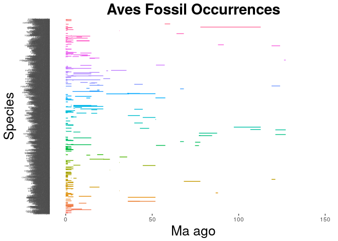
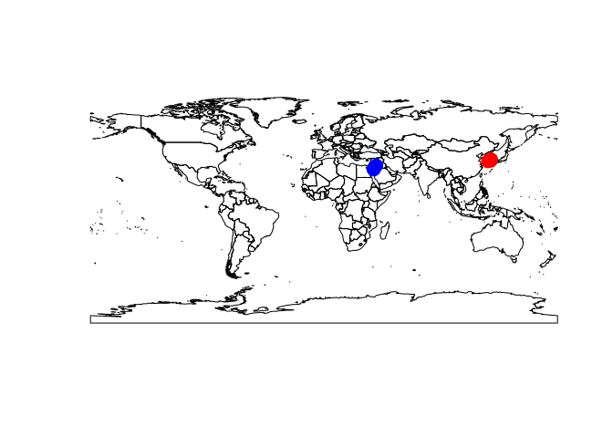
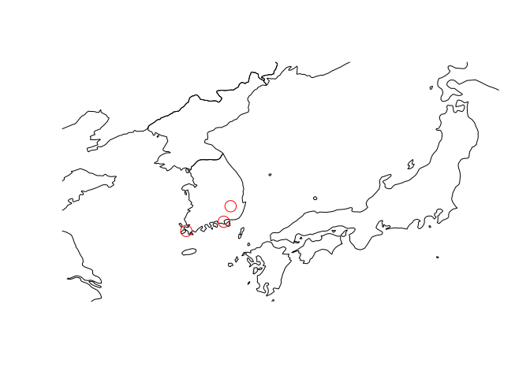
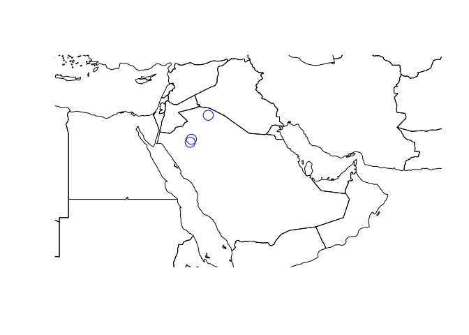

Final Project
-------------

Study of Aves Species through Geologic Time
-------------------------------------------

This study investigates the fossil records of the clades Aves and
investigates two species with the longest ranges between the first and
last occurrence. Contrary to our expectations, these two sepecies were
narrowly ranged location-wise.

\begin{figure}[t]
\label{fig:pop}
\includegraphics[width=15cm, height=15cm,keepaspectratio]{images/tropical-forest.jpg}
\centering
\caption{Tropical forest!}
\end{figure}

Introduction
------------

-   talk about Aves
-   talk about fossil records
-   talk about species geography

Description
-----------

First, in order to study the

first function

Aves Species through Geologic Time
----------------------------------

### Code in Python

The following code was utilized in python to output the genus, speices,
minage, maxage information of each species from the pbdb datafile into
an output file:

    #First, find the age of each species occurrence 

    #open the Aves pbdb data file    
    infile = "A_formatted.csv"
    with open(infile, "r") as ff:
        Aves_recs = ff.readlines()

    #use defaultdict
    from collections import defaultdict

    Aves_ranges = defaultdict(list) #dict is initialized as a list

    #make a dictionary
    for line in Aves_recs:
        record_elements = line.split(",") #split elements by delimiter comma
        if record_elements[6].lower() == '"species"': #if the record is species
            species = line.split(",")[5][1:-1] #removes the quotes
            minage = line.split(",")[10][1:-1] #removes the quotes
            maxage = line.split(",")[11][1:-1] #removes the quotes
            mean_age = (float(minage) + float(maxage))/2 #find mean age
            Aves_ranges[species].append(mean_age) #add species as key and mean ages as elements to the list of ages

    #define output file
    output = open("output_Aves.csv", "w")

    #output the oldest and youngest ages of fossils for each species in species_ranges
    for key in Aves_ranges:
        ages = Aves_ranges[key]
        minage = min(ages) #find minage
        maxage = max(ages) #find maxage
        genus = key.split(" ")[0] #find genus name
        outline = "{}, {}, {}, {}\n".format(genus, key, minage, maxage) #output the genus, species, minage, maxage information in output file
        output.write(outline)

The output\_Aves.csv file was then utilzied to plot the range age of
each Aves specis through geologic time in million years ago (Ma). The
following code was utilized in R:

    library(ggplot2)
    Aves <- read.csv("output_Aves.csv", header = F, as.is = T) #read file, there is no header
    names(Aves) <- c("genus", "species", "minage", "maxage")

    Aves_occ <- ggplot(Aves, aes( species, ymin = maxage, ymax=minage, colour = genus)) #plot the age range of each species, color by genus
    Aves_occ <- Aves_occ + geom_linerange() 
    Aves_occ <- Aves_occ + theme(legend.position="none") #remove legend
    Aves_occ <- Aves_occ + coord_flip() #flip coordinates
    Aves_occ <- Aves_occ + labs(title = "Aves Fossil Occurrences", x = "Species", y = "Ma ago") + theme(plot.title = element_text(hjust = 0.5, size=22, face = "bold"), axis.title =element_text(size=20)) #lablel title, x-axis, y-axis, and format font
    Aves_occ <- Aves_occ + theme(axis.text.y = element_text(size=3), axis.ticks.y=element_blank())
    Aves_occ #contains all species

The above plot of the Aves Fossil Occurrences demonstrate that there are
many more species in the first 10 Ma ago than any time. It can also be
seen that some of the species age ranges are very short while others are
very long. There are two very visible long species ranges. In the next
section, we seek to identify these two species.

Finding the Two Species with the Longest Ranges
-----------------------------------------------

### Code in Python

A second function was defined and utilized to find the two Aves species
with the longest ranges.

    # This function returns a dictionary with the key as species and the value as its range of age 

    def find_range(dict_name, dict_range):
        for key in dict_name.keys():
            ages = dict_name[key]
            range1 = max(ages)-min(ages) #find range of age
            dict_range[key] = range1 #for species as key, put range as value in dictionary

    # Using the function above, put the range age of each Aves species in a dictionary

    Aves_range_age = {} #define dictionary 
    find_range(Aves_ranges, Aves_range_age) #put in the dictionary with  Aves species as key and the range age of the species as value

    # Find the two species with the longest first and last occurrence ranges
    # sort this dictionary from largest range to smallest range
    # in order to do so, sort by the value of the dictionary
    items = [(v, k) for k, v in Aves_range_age.items()] #switch key and value for sorting
    items.sort()
    items.reverse() #largest to smallest
    items = [(k, v) for v, k in items] #swith key and value again
    print(items[:2]) #print the first two items

The outcome of the above code was as below: \[('Uhangrichnus chuni',
34.900000000000006), ('Pelecanus tirarensis', 19.99815)\]

Hence, the two species with the largest ranges are Uhangrichnus chuni
and Pelecanus tirarensis. Uhangrichnus chuni has the largest age range
with 34.9 years. Pelecanus tirarensis has the second largest age range
with 20.0 years.

To study the approximate age of these species, a third funciton was
defined and utilized to find the average age of each species.

### Code in Python

    # This function inputs the Aves name and outputs its geologic time data as the average of max and min ma

    def geotime_ma(Ave_name):
        Ave_name = Ave_name.lower()
        file = open("A_formatted.csv", "r") #open file
        all_records = file.readlines()
        for line in all_records:
            record_elements = line.split(",") #split elements by the delimiter
            if record_elements[5].lower() == Ave_name: #if the element is the Ave of interes, find max and min ma
                maxage = record_elements[10][1:-1]
                minage = record_elements[11][1:-1]
                break
        average = ((float(maxage)+float(minage))/2) #find and return the average ma
        return average

    #Utilizng the function above, print the average ages of the species Uhangrichnus chuni and Pelecanus tirarensis

    print(geotime_ma('"Uhangrichnus chuni"'))
    print(geotime_ma('"Pelecanus tirarensis"'))

The outcome of the above code was as below: 106.75 20.003999999999998

Hence, Uhangrichnus chuni is about 106.75 million years old and
Pelecanus tirarensis is about 20.0 years old.

Mapping the Fossil Occurrences
------------------------------

Python was utilized to extract the species, longitude, and latitude
information of each of the two species' fossil records. This data was
outputted in separate csv files for Uhangrichnus chuni and Pelecanus
tirarensis. \#\#\# Code in Python

    # First output a csv file with the longitude and latitude data points for Uhangrichnus chuni

    #open the Aves location pbdb data file    
    infile = "A_location.csv"
    with open(infile, "r") as fff:
        Aves_loc = fff.readlines()

    output = open("chuni_location.csv", "w")
        #output longitude and latitude data for uhangrichnus chuni

    for line in Aves_loc:
        record_elements = line.split(",") #split elements by delimiter comma
        if record_elements[5].lower() == '"uhangrichnus chuni"': #if the record is uhangrichnus chuni
            species = line.split('","')[5] #removes the quotes/ define species
            longitude = line.split('","')[13] #removes the quotes/ define longitude
            latitude = line.split('","')[14] #removes the quotes/ define latitude
            outline = "{}, {}, {}\n".format(species, longitude, latitude) #output the species, longitude, latitude data
            output.write(outline)

    # Do the same for Pelecanus tirarensis

    #open the Aves location pbdb data file    
    infile = "A_location.csv"
    with open(infile, "r") as fff:
        Aves_loc = fff.readlines()

    output = open("tirarensis_location.csv", "w")
        #output longitude and latitude data for pelecanus tirarensis

    for line in Aves_loc:
        record_elements = line.split(",") #split elements by delimiter comma
        if record_elements[5].lower() == '"pelecanus tirarensis"': #if the record is pelecanus tirarensis
            species = line.split('","')[5][1:-1] #removes the quotes/ define species
            longitude = line.split('","')[13][1:-1] #removes the quotes/ define longitude
            latitude = line.split('","')[14][1:-1] #removes the quotes/ define latitude
            outline = "{}, {}, {}\n".format(species, longitude, latitude) #output the species, longitude, latitude data
            output.write(outline)

R was then utilized to plot the locations of the fossil records of
Uhangrichnus chuni and Pelecanus tirarensis.

### Plotting both species in world map

    chuni <- read.csv("chuni_location.csv", header = F, as.is = T) #read file containing location data for species uhangrichnus chuni
    colnames(chuni) <- c("species", "lon", "lat")
    tirarensis <- read.csv("tirarensis_location.csv", header = F, as.is = T) #read file containing location data for species pelecanus tirarensis
    colnames(tirarensis) <- c("species", "lon", "lat")

    library(rworldmap) #library for worldmap

    ## Loading required package: sp

    ## ### Welcome to rworldmap ###

    ## For a short introduction type :   vignette('rworldmap')

    newmap <- getMap(resolution = "low")

    plot(newmap) + points(chuni$lon, chuni$lat, pch = 19, col = "red", cex = 2) + points(tirarensis$lon, tirarensis$lat, pch = 19, col = "blue", cex = 2) #plot worldmap with red points for species uhangrichnus chuni location and blue points for species pelecanus tirarensis

    ## numeric(0)

### Zooming to see Uhangrichnus chuni

    chuni <- read.csv("chuni_location.csv", header = F, as.is = T) #read file containing location data for species uhangrichnus chuni
    colnames(chuni) <- c("species", "lon", "lat")

    library(rworldmap) #library for worldmap
    newmap <- getMap(resolution = "low")
    library(ggmap)
    asia.limits <- geocode(c("Shanghai, China", "Shenyang, China", "Sapporo, Japan", "Fukuoka, Japan"))

    ## Information from URL : http://maps.googleapis.com/maps/api/geocode/json?address=Shanghai,%20China&sensor=false

    ## Information from URL : http://maps.googleapis.com/maps/api/geocode/json?address=Shenyang,%20China&sensor=false

    ## Information from URL : http://maps.googleapis.com/maps/api/geocode/json?address=Sapporo,%20Japan&sensor=false

    ## Information from URL : http://maps.googleapis.com/maps/api/geocode/json?address=Fukuoka,%20Japan&sensor=false

    asia.limits #set the corners of the plot using GoogleMaps

    ##        lon      lat
    ## 1 121.4737 31.23042
    ## 2 123.4315 41.80570
    ## 3 141.3544 43.06210
    ## 4 130.4017 33.59035

    plot(newmap, xlim = range(asia.limits$lon), ylim = range(asia.limits$lat), asp =1) + points(chuni$lon, chuni$lat, col = "red", cex = 2) #zoom into southeast Asia and plot location for species uhangrichnus chuni

    ## numeric(0)

### Zooming to see Pelecanus tirarensis

    tirarensis <- read.csv("tirarensis_location.csv", header = F, as.is = T) #read file containing location data for species pelecanus tirarensis
    colnames(tirarensis) <- c("species", "lon", "lat")

    library(rworldmap) #library for worldmap
    newmap <- getMap(resolution = "low")
    library(ggmap)
    middle_east.limits <- geocode(c("Khartoum, Sudan", "Muscat, Oman", "Antalya, Turkey", "Tehran, Iran"))

    ## Information from URL : http://maps.googleapis.com/maps/api/geocode/json?address=Khartoum,%20Sudan&sensor=false

    ## Information from URL : http://maps.googleapis.com/maps/api/geocode/json?address=Muscat,%20Oman&sensor=false

    ## Information from URL : http://maps.googleapis.com/maps/api/geocode/json?address=Antalya,%20Turkey&sensor=false

    ## Information from URL : http://maps.googleapis.com/maps/api/geocode/json?address=Tehran,%20Iran&sensor=false

    middle_east.limits #set the corners of the plot using GoogleMaps

    ##        lon      lat
    ## 1 32.55990 15.50065
    ## 2 58.40592 23.58589
    ## 3 30.71332 36.89689
    ## 4 51.38897 35.68920

    plot(newmap, xlim = range(middle_east.limits$lon), ylim = range(middle_east.limits$lat), asp =1) + points(tirarensis$lon, tirarensis$lat, col = "blue", cex = 2) #zoom into northeast MiddleEast and plot location for species pelecanus tirarensis

    ## numeric(0)

Discussion
----------

References
----------
