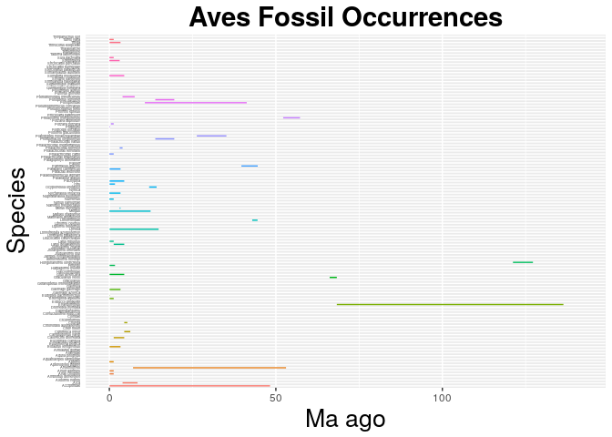

    library(ggplot2)
    Aves <- read.csv("output_Aves.csv", header = F, as.is = T)

    ## Warning in read.table(file = file, header = header, sep = sep, quote =
    ## quote, : line 1 appears to contain embedded nulls

    names(Aves) <- c("genus", "species", "minage", "maxage")
    head(Aves)

    ##           genus                   species  minage  maxage
    ## 1      Aramidae                  Aramidae  11.950  11.950
    ## 2        Matuku          Matuku otagoense  17.450  17.450
    ## 3 Iberomesornis    Iberomesornis romerali 127.725 127.725
    ## 4      Coliidae                  Coliidae  31.150  31.150
    ## 5  Phorusrhacos  Phorusrhacos longissimus  13.789  19.500
    ## 6   Parvirallus      Parvirallus gracilis  39.650  44.550

    Aves_occ <- ggplot(Aves, aes( species, ymin = maxage, ymax=minage, colour = genus))
    Aves_occ <- Aves_occ + geom_linerange()
    Aves_occ <- Aves_occ + theme(legend.position="none")
    Aves_occ <- Aves_occ + coord_flip()
    Aves_occ <- Aves_occ + labs(title = "Aves Fossil Occurrences", x = "Species", y = "Ma ago") + theme(plot.title = element_text(hjust = 0.5, size=22, face = "bold"), axis.title =element_text(size=20))
    Aves_occ <- Aves_occ + theme(axis.text.y = element_text(size=3), axis.ticks.y=element_blank())
    Aves_occ #contains whole data

