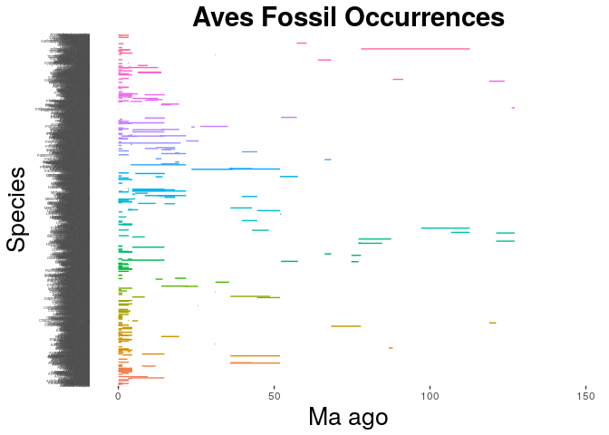

    library(ggplot2)
    Aves <- read.csv("output_Aves.csv", header = F, as.is = T)
    names(Aves) <- c("genus", "species", "minage", "maxage")
    head(Aves)

    ##             genus              species    minage    maxage
    ## 1       Abavornis  Abavornis bonaparti  83.25000  83.25000
    ## 2 Aberratiodontus  Aberratiodontus wui 119.00000 119.00000
    ## 3       Accipiter            Accipiter   0.00585   3.35000
    ## 4       Accipiter    Accipiter cooperi   0.06885   0.06885
    ## 5       Accipiter  Accipiter fasciatus   0.00585   0.00585
    ## 6       Accipiter   Accipiter gentilis   0.06300   0.45350

    Aves_occ <- ggplot(Aves, aes( species, ymin = maxage, ymax=minage, colour = genus))
    Aves_occ <- Aves_occ + geom_linerange()
    Aves_occ <- Aves_occ + theme(legend.position="none")
    Aves_occ <- Aves_occ + coord_flip()
    Aves_occ <- Aves_occ + labs(title = "Aves Fossil Occurrences", x = "Species", y = "Ma ago") + theme(plot.title = element_text(hjust = 0.5, size=22, face = "bold"), axis.title =element_text(size=20))
    Aves_occ <- Aves_occ + theme(axis.text.y = element_text(size=3), axis.ticks.y=element_blank())
    Aves_occ #contains whole data

    Aves_occ2 <- Aves_occ + scale_y_continuous(limits=c(0, 40), expand = c(0, 0), breaks=c(0, 10, 20, 30, 40)) #zooms into the first 4mya
    Aves_occ2

    ## Warning: Removed 390 rows containing missing values (geom_linerange).

