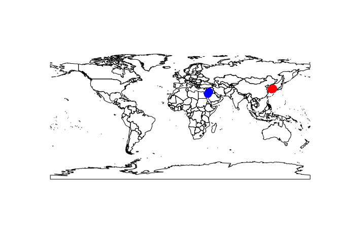

    chuni <- read.csv("chuni_location.csv", header = F, as.is = T) #read file containing location data for species uhangrichnus chuni
    colnames(chuni) <- c("species", "lon", "lat")
    tirarensis <- read.csv("tirarensis_location.csv", header = F, as.is = T) #read file containing location data for species pelecanus tirarensis
    colnames(tirarensis) <- c("species", "lon", "lat")

    library(rworldmap) #library for worldmap

    ## Loading required package: sp

    ## ### Welcome to rworldmap ###

    ## For a short introduction type :   vignette('rworldmap')

    newmap <- getMap(resolution = "low")

    plot(newmap) + points(chuni$lon, chuni$lat, pch = 19, col = "red", cex = 2) + points(tirarensis$lon, tirarensis$lat, pch = 19, col = "blue", cex = 2) #plot worldmap with red points for species uhangrichnus chuni location and blue points for species pelecanus tirarensis

    ## numeric(0)

    chuni <- read.csv("chuni_location.csv", header = F, as.is = T) #read file containing location data for species uhangrichnus chuni
    colnames(chuni) <- c("species", "lon", "lat")
    head(chuni)

    ##              species      lon      lat
    ## 1 Uhangrichnus chuni 128.4033 34.99110
    ## 2 Uhangrichnus chuni 126.4000 34.50000
    ## 3 Uhangrichnus chuni 128.7686 35.82167

    library(rworldmap) #library for worldmap
    newmap <- getMap(resolution = "low")
    library(ggmap)

    ## Loading required package: ggplot2

    asia.limits <- geocode(c("Shanghai, China", "Shenyang, China", "Sapporo, Japan", "Fukuoka, Japan"))

    ## Information from URL : http://maps.googleapis.com/maps/api/geocode/json?address=Shanghai,%20China&sensor=false

    ## Information from URL : http://maps.googleapis.com/maps/api/geocode/json?address=Shenyang,%20China&sensor=false

    ## Information from URL : http://maps.googleapis.com/maps/api/geocode/json?address=Sapporo,%20Japan&sensor=false

    ## Information from URL : http://maps.googleapis.com/maps/api/geocode/json?address=Fukuoka,%20Japan&sensor=false

    asia.limits #set the corners of the plot using GoogleMaps

    ##        lon      lat
    ## 1 121.4737 31.23042
    ## 2 123.4315 41.80570
    ## 3 141.3544 43.06210
    ## 4 130.4017 33.59035

    plot(newmap, xlim = range(asia.limits$lon), ylim = range(asia.limits$lat), asp =1) + points(chuni$lon, chuni$lat, col = "red", cex = 2) #zoom into southeast Asia and plot location for species uhangrichnus chuni

    ## numeric(0)

    tirarensis <- read.csv("tirarensis_location.csv", header = F, as.is = T) #read file containing location data for species pelecanus tirarensis
    colnames(tirarensis) <- c("species", "lon", "lat")
    head(tirarensis)

    ##              species      lon      lat
    ## 1 elecanus tirarensi 40.23333 31.16667
    ## 2 elecanus tirarensi 38.25471 28.22000
    ## 3 elecanus tirarensi 38.39473 28.55139

    library(rworldmap) #library for worldmap
    newmap <- getMap(resolution = "low")
    library(ggmap)
    middle_east.limits <- geocode(c("Khartoum, Sudan", "Muscat, Oman", "Antalya, Turkey", "Tehran, Iran"))

    ## Information from URL : http://maps.googleapis.com/maps/api/geocode/json?address=Khartoum,%20Sudan&sensor=false

    ## Information from URL : http://maps.googleapis.com/maps/api/geocode/json?address=Muscat,%20Oman&sensor=false

    ## Information from URL : http://maps.googleapis.com/maps/api/geocode/json?address=Antalya,%20Turkey&sensor=false

    ## Information from URL : http://maps.googleapis.com/maps/api/geocode/json?address=Tehran,%20Iran&sensor=false

    middle_east.limits #set the corners of the plot using GoogleMaps

    ##        lon      lat
    ## 1 32.55990 15.50065
    ## 2 58.40592 23.58589
    ## 3 30.71332 36.89689
    ## 4 51.38897 35.68920

    plot(newmap, xlim = range(middle_east.limits$lon), ylim = range(middle_east.limits$lat), asp =1) + points(tirarensis$lon, tirarensis$lat, col = "blue", cex = 2) #zoom into northeast MiddleEast and plot location for species pelecanus tirarensis

    ## numeric(0)
